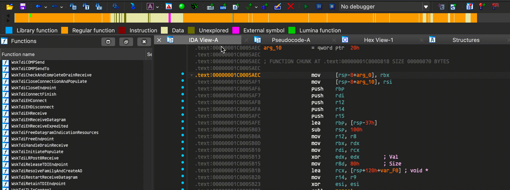

# FeelingLucky

<p align="center">

</p>

Amidst the labyrinthine realm of countless functions, even the most adept reverse engineers can find themselves adrift in a sea of complexity. But today, fortune smiles upon me, and I am feeling lucky.

FeelingLucky, as the name implies, is not your ordinary IDA plugin. It is a tool that defies the odds, allowing us to venture into the uncharted territories of code with a roll of the dice. With each invocation, it becomes our compass, leading us to a random function, guided solely by the capricious whims of chance.

Within this chosen path lies the potential for revelation, the prospect of uncovering hidden gems that lie dormant within the cryptic lines of code. It is an exhilarating expedition, where even an ordinary mortal like me can aspire to conquer the enigmatic enclaves of binary puzzles.

Embrace the uncertainty, embrace the challenge, and join me in this audacious pursuit. Today, we embark on a quest fueled by curiosity, driven by the belief that luck favors the intrepid. Are you ready to unlock the secrets that lie within the depths of the code?

FeelingLucky - where serendipity and expertise intertwine, unraveling the extraordinary. Take a leap of faith and let us explore together, guided by the fortuitous roll of the dice.



## Installation

Put this whole github repo under the plugin folder of IDA, and make sure the folder name is FeelingLucky.

```
C:\Program Files\IDA Professional 9.0\plugins>git clone git@github.com:terrynini/FeelingLucky.git
```
